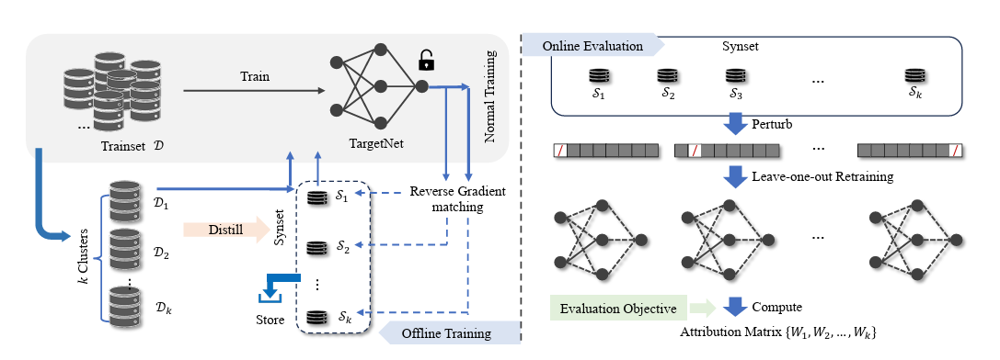

# Distilled Datamodel with Reverse Gradient Matching Reproduction

# Overview of the Paper

Distilled Data Model (DDM) is introduced in this paper. It discovers how training data affects a model that has already been trained. DDM uses a tiny synthetic collection of samples (synset), instead of expensive retraining. In the offline phase, the synset is created via reverse gradient matching. During the online phase, the synset facilitates the rapid approximation of the impact of data removal on the model. This provides an attribution matrix that shows how each data cluster contributed to the predictions. Experiments demonstrate that DDM performs as well as retraining but is considerably faster. The framework of the proposed distilled datamodel from the paper.



## What It's About

- **The Challenge:**
  State-of-the-art AI models need huge amounts of training data. In order to calculate how much a single sample affects the model, one would usually remove a sample and train the model again. But performing this for every sample takes too much time and processing power.

- **The Idea:**
  The paper proposes a method known as the **Distilled Datamodel (DDM)**. Instead of retraining the model every time, it works in two stages:

1. **Offline Training:**
   During training the model, the technique forms an extremely small synthetic data set known as a **synset**. The synset maintains important information about the effect of training data on the model. The major technique used here is referred to as **reverse gradient matching**.

2. **Online Evaluation:**
   After we have trained the model and generated the synset, it is straightforward for us to study the effect of removing some of the training data. This will allow us to simulate data removal without having to retrain the entire model from the beginning. This save both time and computational resources.

- **Why It's Useful:**
  - It saves enormous time and computation.
  - It is simpler to identify which training examples are most important.
  - It also protects the privacy of the original data by using a synthetic replica that does not disclose evident details of the true images.

Generally, this paper offers a useful method of establishing the impact of training data on the action of a model without the excessive cost of repeated retraining.

---

## 📂 Repository Structure

```
.
├── 📄 README.md             # Detailed guide and usage instructions
├── 📄 requirements.txt       # List of all project dependencies
├── 📁 notebooks             # Jupyter notebooks for experiments
│   └── reproducing-cvpr-paper-ddm-mnist.ipynb
├── 📁 results               # Output results and figures from experiment
│   ├── figures/             # Figures generated from experiment
│   ├── synset_dataset/      # Synthetic dataset created for DDM evaluation
│   └── trained_models/      # Models trained during experiments
└── 📄 .gitignore            # Specifies files and folders to ignore in Git
```

---

## 🚀 Getting Started

### 1. Clone the Repository

Clone this repository to your local machine using:

```bash
git clone git@github.com:islam15-8789/Distilled_Datamodel_with_Reverse_Gradient_Matching_Reproduction.git
cd Distilled_Datamodel_with_Reverse_Gradient_Matching_Reproduction
```

### 2. Environment Setup

#### a. Create a Virtual Environment

It's recommended to use a virtual environment to manage dependencies. For Python 3, run:

```bash
python3 -m venv RCP_DDM
```

Activate the environment:

- **On macOS/Linux:**

  ```bash
  source RCP_DDM/bin/activate
  ```

- **On Windows:**

  ```bash
  RCP_DDM\Scripts\activate
  ```

#### b. Install Dependencies

Install all required packages listed in `requirements.txt` by running:

```bash
pip install -r requirements.txt
```

---

You can add a short, icon-enhanced section like this right before the "Running Jupyter Notebooks" section:

---

### Optional: Jupyter Kernel Setup

After installing dependencies, register your virtual environment as a Jupyter kernel by running:

```bash
python -m ipykernel install --user --name myenv --display-name "Python (RCP_DDM)"
```

- **What it does:** Registers your virtual environment as a selectable kernel in Jupyter.
- **Note:** Skip this if you're using the default environment.

---

## Running Jupyter Notebooks

This repository includes one Jupyter notebook for exploring the DDM framework:

To start Jupyter Notebook, run:

```bash
jupyter notebook
```

Then, open and run the notebook inside the `notebooks/` folder.

---

## 📊 Dataset Information

For our experiments, we use the **MNIST** dataset, a widely used benchmark in machine learning. MNIST contains:

- **60,000 training samples**
- **10,000 testing samples**

Each sample is a grayscale image of a handwritten digit (28x28 pixels). You can download the MNIST dataset directly from the Touch library (or via the `torchvision` package) using the following code snippet:

```python
from torchvision import datasets, transforms

# Define a simple transformation to convert images to tensors
transform = transforms.Compose([transforms.ToTensor()])

# Download the MNIST training and test datasets
train_dataset = datasets.MNIST(root='./data', train=True, download=True, transform=transform)
test_dataset = datasets.MNIST(root='./data', train=False, download=True, transform=transform)
```

Place the dataset in the `./data` directory or update the path as needed.

---

## 📝 Usage Instructions

### a. Offline Training

This phase creates the synset, a compressed synthetic representation of your training data's influence:

1. **Train on Full Dataset:**

   - Train your model on the complete dataset.
   - Store the gradients for each sample, capturing their influence on the model.

2. **Class-wise Clustering:**

   - Cluster the dataset by class.
   - This groups similar samples together.

3. **Initialize Synset:**

   - For each cluster, select one representative image.
   - This forms the initial synset with one image per cluster.

4. **Apply Reverse Gradient Matching:**
   - Refine the synset by applying reverse gradient matching.
   - This step adjusts the synset to better capture the training data’s influence.

### b. Online Evaluation

This phase leverages the synset to quickly evaluate the effect of data removal:

- **Simulate Data Removal:**  
  Use the synset to mimic the removal of specific data clusters without retraining the entire model.

- **Compute Attribution Matrix:**  
  Calculate an attribution matrix that quantifies the impact of each data cluster on the model's predictions.

---

## License

This project is licensed under the MIT License. See the [LICENSE](LICENSE) file for details.

---

## 📬 Contact

For questions or feedback, please reach out via:

- Email: arniislam777@gmail.com
- GitHub: [islam15-8789](https://github.com/islam15-8789)
